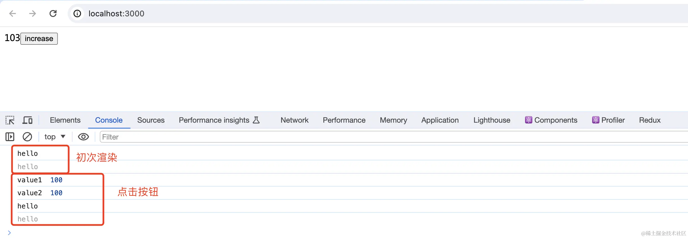

# 面试题
- 初次渲染这个组件，控制台会打印什么，组件的 `<span>{value}</span>` 显示什么值
- 然后点击 `increase` 按钮，控制台会打印什么，组件的`<span>{value}</span>`显示什么值

# 作答
## 初次渲染
控制台打印两次 demo01 ，值为 100

## 重复渲染
React18 开发环境下，组件渲染时会被执行两次，这是为了更早的验证组件完整的生命周期。生产环境下不会重复渲染。这个知识点很多同学都不知道，虽然他们也是 React 技术栈的

所以 demo01 会打印两次

## 异步更新 State
继续第二步时，点击按钮，value1 和 value2 分别打印
```
大部分的人的答案是
value1 101
value2 103
```

但是答案是错误的，正确答案是 value1 和 value2 都是 100.
不管 vue 和 React 都是异步渲染的，同步代码中无法获取最新的值

不过值得肯定的是，大部分知道 setValue（value + 1）会合并更新，而 setValue((v) v+ 1) 不会合并更新。所以最后也没显示 103

## 还没结束
- 追问 'demo01' 还要会打印吗？
ans: 如果不考虑 React18 的话，demo01 还会打印一次

# 分析整个过程
第一，组件初次渲染

- 执行函数
- 打印 'demo01'
- 定义 value 值 100
- 定义 clickHandler 函数，但未执行，且不管它（未执行的函数，就当作一个黑盒，不管）
- 返回 UI ，值是 100

第二，点击按钮

- 执行 clickHandler 函数
- 执行两步 setState 但异步更新
- 打印 value1 100
- 执行两步 setState 但异步更新
- 打印 value2 100

第三，state 变化触发组件更新

- 执行函数
- 打印 'demo01'
- 定义 value 值 103 —— 【注意】到这一步才获取到最新的 state
- 定义 clickHandler 函数 —— 是的，重复定义了，如不想重复请用 useCallback
- 返回 UI ，值是 103

